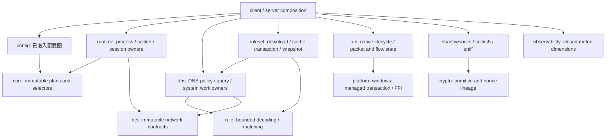

# 全量审查后的工程设计与实施顺序

本设计接续 [全量生产静态审查](engineering-audit-2026-09-05.md)，产品基线为
`2fb0dd4a9099837b81586a11fba4d265777674bb`，审查记录为 `fc6180b2`。
19 个 workspace package 的生产源码已审查；独立 test-only 源码仍有部分未读。
**这是选定的实施设计，尚非实现完成或性能验收。** 先完成架构整改并验证不回退，
随后才通过现有 Qualification 获取 CPU 样本、选择性能优化。

## 选择的模块关系

保留现有 crate 职责与主要依赖方向，不新增通用 executor、网络平台 façade 或 benchmark
框架。把目前调用者要自行维持的状态、释放顺序和失败契约移入真正拥有它们的模块。

图只显示本设计相关方向，完整依赖以 workspace manifest 为准。`net` 不拥有 Tokio、系统
resolver 工作或平台生命周期；`observability` 不反向依赖协议、runtime 或配置。
Linux 继续支持普通代理，真实 TUN 仍仅 Windows x86_64；hosted seam 不冒充 Linux TUN。

## D1：先修测量与资格证据的可信转换

对应 CT-01..07、CW-01、RTL-01..08、M4、HT、CPU 工具发现。
详细方案见 [Qualification 设计](engineering-design-2026-09-05/qualification.md)。

- Windows CPU/work 使用实际 CPU 窗口与 checked work；PS 与 Python 同批修正，保留现有
  reviewed 阈值。Linux 只读一次 bounded bytes，并由同一份 bytes 生成解析值与 digest。
- summary 的场景闭包来自 canonical catalog，派生数值从 raw 重算，跨组 build/recipe/
  environment 一致；不能仅信任摘要自己的 mandatory 列表或成功标记。
- Rule report 重算 duration/operations、分位数、allocation 和 parity。先验证完整 calibration
  applicability，再启动 runner；fixture 内容、配置与 measurement policy 是工作负载身份。
- 清理成功必须来自 run-owned 状态的最终读回，未知不能写成0。保留期延伸至最终验证，
  失败日志先导出再清临时目录。workflow 的 final cleanup 与 producing job 结果绑定到最终证据。
- M4 已启动 worker/process 立即交唯一 owner，所有退出先解除阻塞依赖再完整 join；计量修正
  保留实际 active window、完成/失败/丢弃计数，不能延长负载却用名义时长作分母。
- 普通 workspace test 显式排除 `ferrum2-rule-qualification` 并保留 `--no-run`，同步 root
  命令、CI 和现有 workflow contract。资格工具的 timed tests 仍由明确测量入口执行。

代价是更严格的证据接受条件与少量控制面验证工作。工具/recipe/source bundle 变更使旧
结果不适用；同一新版 harness 必须分别测旧产品与新产品，不能把工具变化记作产品提速。
correctness 与 performance 的 public runner、source bundle、verdict 始终独立。

## D2：配置图先准入，再做一次有界推导

对应 FND-01/02/05 与失效 selector error。
详细方案见 [配置与缓存设计](engineering-design-2026-09-05/foundations-cache.md)。

`config::validation::egress_graph` 私有模块先校验现有 cohort/member/chain 限额与身份，再
解析 typed references、检测环，按拓扑次序计算 capability 与 first-hop bitset。
最多64个 outbound 的集合不需要展开所有路径；共享 DAG 每条边只参与有界推导。
删除先递归 capability、后检查数量的顺序和另一套 string/path 展开，保留 core 对公开输入
独立验证。egress 图与 DNS/RuleSet dependency 图的语义不同，二者不合成通用图框架。

listener role/index/transport/address 由同一私有检查模块消费，统一现有 same-family wildcard
overlap；TUN pseudo inbound 不当真实 socket。跨 IPv4/IPv6 重叠依实际 V6ONLY 契约单独确认。
字段诊断保持闭合，不泄漏地址。废弃错误变体与所有仓内 match 同批删除。

代价是保留一次 typed 图及小集合；收益是验证顺序、复杂度与调用方输入契约集中。
嵌套 selector 的跨选择器线性一致性尚无产品契约，保持现有每次输出完整不可变 plan 的保证；
不凭这个未确立需求引入全局锁。私有化 validated 字段只针对确会绕过不变量的入口。

## D3：RuleSet 的字节、编译与文件始终由同一实际工作拥有者收管

对应 FND-03/04、RD-02/03/08；详见同一 [资源设计](engineering-design-2026-09-05/foundations-cache.md)。

`rule` 的一个 `SrsDecodeLimits`/`DecodeContext` 同时计 encoded、decoded、节点、entry、展开
字节与 work；限制在读入、扩展和 reserve 前检查，重复条目也消耗预算。LOUDS 逐项交给
collector，避免完整展开结果再复制一次。IPv6 inclusive end 先判断是否结束，再计算后继。
所有 decoder caller 同次迁移，不保留 unlimited overload；不改变 reviewed fixture 内容。

`ruleset` 的 typed cache work owner 负责目录锁、临时文件、写入、哈希、解码、构建、同步、
replace 与清理。流式下载通过两个32KiB chunk 的有界通道交给 worker；实际工作 permit
直到 worker 结束才释放，取消等待者不能释放实际并发名额。删除异步 frame 内临时文件和
绕过 owner 的 `tokio::fs`。snapshot 构建也属于受管阻塞工作，保持完整 generation 发布。

cache 选择**单个原子替换 container**，包含 bounded header、原 SRS 与 metadata。
reader 持有同一个打开文件完成验证；删除 `.srs`+`.meta` 双文件提交和旧 reader。
loader-lifetime 独占目录锁阻止不同 loader/process 对同缓存目录并发写入；不删除旧或无关
缓存文件。metadata-only 更新可能重写 payload，这是简单完整提交的 I/O 代价。
固定目录锁比按 key 的锁更粗，现有顺序 materialization/refresh 不需要扩张并发。

文件替换与内存 Arc 发布不能跨域原子：取消可能留下完整新 cache 与完整旧 live generation，
不能留下半份 cache 或部分 registry。原子可见性也不等于 Windows 掉电持久性。
OS write/sync/lookup 不可强制取消时，owner 继续保留实际工作；不以 detach 兑现虚假时限。

设计附件中的64MiB encoded、128MiB decoded等是**暂定工程限额**，须先对现有 pinned/generated
fixtures 做 census 并核对编译结构上界，再落为产品默认值；不据这些数字宣布生产可用。
暂停的旧 SRS patch 不自动恢复。registry 聚合预算与单文件预算分别拥有，外部长期保留 Arc
的历史 snapshot 不在一个 loader 可强制释放的范围内。

## D4：系统解析与 query/monitor 的实际工作生命周期

对应 RD-01/04/05/06/07、C4。
详细方案见 [运行时资源设计](engineering-design-2026-09-05/runtime-resolution.md)。

选择 `dns` 拥有 concrete system resolution handle 与唯一 shutdown/join owner，通过既有
`net::TcpResolver`/`UdpResolver` seam 注入 runtime。删除 runtime 内隐式 system resolver
默认构造；所有 binary、RuleSet 与测试 caller 同次迁移。配置 resolver 失败仍不回退系统 DNS。
handle 可 clone，join owner 不 clone；限制包含取消后仍在执行的 OS 工作，而非仅限制 future。

DNS command loop 保留 query record（admission、子任务注册/回收、reply），query body 的
成功、错误、panic 都先进入共同清理，再返回终态和释放名额。注册关闭与 join 由同一 owner
协调，移除 child 通过 registrar 留住自身 task set 的所有权环。
network snapshot 与 generation socket monitor 由网络专属 owner 保管实际 completion/join，
保留 generation 变更时主动关 socket 的行为，不新增 `net` 的 Tokio 依赖。

Direct UDP 的终态要被消费并输出闭合原因，既有清理 owner继续保证每条退出清资源。
协议 commit 的 mutex 内原子语义保持，明确非阻塞/非重入 callback 契约，并在持 guard 的
范围内收住 panic，转成终态后再释放 guard，避免 poison/Drop 双 panic；不创造通用事务框架。
附件提出新增 `UdpProtocolCommit` trait；集成时选择保留一个有明确义务的 closure Interface，
审查现有 concrete caller，并集中异常处理。trait 本身不能禁止捕获 manager 后重入，新增
一组转发 Adapter 无法提供更强保证，因此不采用；如果实际迁移出现多余入口则一并删除。
无法自动回滚任意 callback 副作用，测试/文档不得宣称具备这一保证。

代价是明确的 shutdown 所有者和有限 native worker/queue。系统调用本身无硬时限；已占满
名额时拒绝或在原 absolute deadline 内等待，不能增加线程来隐藏过载。

## D5：TUN 握手与 join 是一个私有生命周期模块

对应 PLAT-01..04/10。三个独立方案先分别设计，再统一选择：

| 方案 | Interface / caller 知识 | 收益与代价 | 决定 |
|---|---|---|---|
| 极小单入口 | named request → 现有 ProcessRoot；私有 owner 收管握手、deadline、join | 释放协议集中；增加控制面 completion 状态 | 采用其所有权范围 |
| 默认 caller | 同样保留 ProcessRoot；native 10ms stop-aware recheck | 迁移小，但引入周期唤醒与另一组停止检查 | 采用 named request，舍弃轮询 |
| 可组合 transition | LifecycleDriver/NativeLease + ManagedPlane/NetworkEpoch | 资源阶段更显式，但多一组组合与消费式状态 | 采用可关闭 link，暂不整段重写 native transition |

最终外部 Interface 是 `process_root(TunRootRequest<E>) -> ProcessRoot<E>`，request 命名
config、network、handlers、events、registry、startup/runtime/cleanup error。
binary 不再传12个位置参数，也不接触 ready/reset receiver 或 native handle。
删除旧形态与重复 RootSpec/RootErrors，保留现有 supervisor prepare/activate/run/rollback。

私有 `NativeLifecycleOwner` 从 spawn 成功起同时拥有可关闭 `LifecycleLink` 与 join custody。
link 用单槽共享状态、Mutex/Condvar 和 Tokio notification；登记请求与 closed 状态在同一
协议下线性化。native 串行最多一个请求在途，control path 使用锁，packet loop 不使用。
pending 或已 dequeue 的 response lease 在 close/Drop 后给 Stopped，迟到完成不能重开准入。
notify 采用先注册再复查谓词，native 等待用 predicate loop；不依赖队列 payload 的偶然析构。

所有最终退出同步执行：关准入/登记 → close link、释放 queued/in-flight completion →
signal native stop → 取消并 join async handlers → 完成 native cleanup 与 join → 合并结果。
close 不持锁 join、不调用用户 callback；prepare/run/rollback/future Drop 都走同一顺序。
已有 PendingThreadJoin 保留“真正 join 完成才算结束”的契约。
同一 ready deadline 覆盖 Initialize 和 native Prepared 确认；OS 操作/反向清理的实际返回
不伪称受硬 deadline 限制。cleanup failure 优先于取消、超时及业务失败，且一经观察不抹除。

target-neutral bridge 通过与生产相同的私有 NativeJob seam 测真实线程/通道；hosted job
只运行有限脚本，不创建 adapter。它能覆盖握手/join，不能替代完整 Windows owner/platform
事务验证。平台依旧使用现有 injected operations，unsafe 范围不扩张。

## D6：平台事务、reset 次序与可观察健康状态

对应 PLAT-03..12；详见 [平台完整性设计](engineering-design-2026-09-05/platform-integrity.md)。
通知订阅一创建就进入 staged transaction，setup 失败先保留每项 cleanup 结果再返回。
TUN 只消费 platform 的 cleanup classification，不猜测被丢失的原因。
health 区分 Exact、ConfirmedDamage、Unavailable；MTU 加入同一 readback。
DLL 先校验 pinned size，再 bounded hash/read 与 EOF；raw directory handle 立即入 RAII。
validated adapter config 字段私有化，所有 caller 使用验证构造；既有 unsafe trait义务补全。
TCP generation 耗尽的 slot 永久退出 free list，不能挡住其他可用 slot。

审查设计阶段又发现 ordinary reset 在 TUN owner 与 runtime coordinator 两层均存在
“先 cancel/clear、后 hook/publish”的顺序差异。整改按当前 AGENTS 的
quiesce admission → publish generation → hooks → cancel owners → clear → replace → reopen
落实。generation fence 与 storage retirement 分开；旧 stack 暂停驱动期间保留资源。
retry 保留同一个 pending snapshot，不能给已发布 generation重新发首次 reset。
静态调用链核对表明 handler 取消与 generation socket monitor 会独立注销旧 owner，不依赖
native quiesce；因此选用单次 reset 请求：hooks仅fence，coordinator cancel/wait后callback
同步retire/reopen hub，native再clear/replace。无需新增worker或两阶段握手；动态验证尚待实施。
full rebuild 的反向清理保持独立。
该项在桥与平台分类修好后单独实施、单独验证，不借迁移改变 ring-full drop 或 managed identity。

## D7：UDP 接纳状态与协议能力由各自模块拥有

对应 C1..8、PROTO-1..5、FND-06/07；详见
[协议与 composition 设计](engineering-design-2026-09-05/composition-protocols.md)。

SOCKS first candidate 携带 source，egress 容量/generation/encode 接纳成功后才 pin；可恢复
预算拒绝返回 Awaiting 并丢 provisional route。已 Active 的 association 不因后续拒绝改源
或改 frozen route。`ClientUdpAssociation` 以 Direct/Proxy 及 Prepared/Active 状态表达
资源，named accounting 代替不透明 boolean，删除无效 Option 组合与重复 remove。

TUN UDP 每个 datagram 先检查 exact synthetic DNS，再处理 frozen ordinary terminal。
同源 Reject→synthetic 可答 DNS，同时 ordinary Reject 保持；删除独立 reject-only reader。
Shadowsocks 活动时间在成功 commit 中取 max，batch 任一失败不更新状态。
token/capability 用私有 checked constructor identity 绑定 owner；构造耗尽 fail closed，
不得每包分配 Arc、复制 key 或用地址当身份。primitive session lineage 同样明确并更新映射。

observability 的 enum、labels、合法 grid 来自一个闭合声明；全部合法值有独立 series，
新增固定 series 的内存成本记录在实施证据。TCP sniff 按真实 transport/collector终态上报。
server accept 保留闭合 ErrorKind 让 runtime 执行现有 transient retry；startup report 保留
root role/index/stage 与 cleanup，不记录地址/raw error。删除 server 未使用 DNS proxy 图，
保留真实 materialization policy 验证与 exact resolver 选择。移走 fixture-only primitive
exports、废弃尺寸常量和无用 alias；borrowed plan Debug 与 owned 形式同样 redact，空 rule
field 在公开构造入口拒绝。接口调整的全部仓内 caller、fixture 和文档同批迁移。

代价包括每 owner 一次 checked identity 分配、少量整数比较、有限 telemetry series；
Direct/Proxy enum 的布局可能增大，先测实际大小再决定是否 box。这里没有选择 packet copy、
buffer/timer 或 crypto 算法优化；这些留待 CPU 样本。

## 实施里程碑与验收

| 里程碑 | 可独立审查的结果 | 先行条件与验证 |
|---|---|---|
| M1 证据契约 | 普通 gate compile-only；CPU/window 与 raw/summary/recovery 校验；worker回收 | offline Python、PS parser/contract、M4 self-check、受影响工具 compile/lint；刷新完整source bundle |
| M2 有界资源 | typed config graph、SRS限界与原子cache、实际resolver/query工作 owner | fixture census、受影响包契约；保留此前被拦动态操作的未验证状态，不换方式重试 |
| M3 平台生命周期 | 可关闭TUN握手、cleanup分类、health/handle、ordinary reset | hosted-safe bridge/platform suites、client no-run、all-feature check；之后专用host correctness |
| M4 接纳与接口 | UDP states/identity、closed观测、错误恢复、旧路径删除 | protocol/core/rule tests、safe跨进程contract、client no-run；受影响lint后完整适用gate |
| M5 架构性能验收 | 相同新版harness测旧产品/新产品，完整A/A及A/B，按现有policy报告 | M1完成先收旧产品基线；M2–4正确性完成才验候选；缺测量/噪声大/失败则不进入优化 |
| M6 样本驱动优化 | Qualification短时CPU样本→具体假设→小批优化→重新配对测量 | M5达到有证据的场景限定结论；profiler与无采样测量独立 |

大里程碑内仍按一个可独立 review/revert 的问题提交，不累积成最终大 commit。
不提交 target/profiles/raw archives，不推送或部署。用户已授权执行，无需另加设计审批流程。
2026-09-06 执行调整：M1 停止新增范围，剩余工具项后置；M2a 配置图已实现，修改前固定
基准为 `cba03a44`（产品源码同 `2fb0dd4a`）。工具全部清零不再阻塞 M2–4；逐批进展与
实际验收以[整改记录](engineering-remediation-2026-09-05.md)为准，M5/M6 的证据要求不变。

暂定验收不自创新 SLO：正确性、明确资源上限、故障可诊断、完整回收必须满足；性能沿用
reviewed policy，并并列报告 p50/p95/p99、吞吐、错误/丢弃、CPU/work、峰值及变化范围。
closed-loop RTT 与 batch ns/op 均不当 open-loop 排队 tail；缺失的过载/长期负载证据单列。
Windows/WSL各自记录硬件、内核、工具链、profile/flags、配置、连接/包大小、预热/时长/次数。
同一构建/负载的完整 interleaved pairs 不拼接、不删失败或离群点；噪声不能证明无回退。

最终相关 gate 保留根/作用域命令要求：affected fmt/lint/test → workspace build/tests（排除
四个特殊包）→ client与rule-qualification no-run → TUN/platform hosted-safe → DNS interop
root →全workspace fmt/clippy/doc→M4 self-check与四组Python/PS static。GNU/musl/provider/
fuzz及privileged项按各runner实际环境分别记录；本机不能执行的项写明命令与缺少环境。
没有全平台资格证据，不宣布整个项目生产可用。

## 证据与继续位置

历史修复与失败保留在 [整改记录](engineering-remediation-2026-09-05.md)及
[逐批证据](engineering-remediation-evidence-2026-09-05.md)，并未因本设计升级为当前资格。
新增本地不可变副本 `profiles/remediation-evidence-20260905T125933Z` 保存1046文件、
174541121 bytes；manifest SHA-256 为
`a5546a1415ce4428813c61d72a40cb03fe11286694e07981dbde10f18f3ae24a`。
它包含后续十次host运行、cache测量、审查记录与日志；逐项源/副本哈希相同。
旧archive和暂停SRS patch均未改写。新增run仍须另留原始证据，不能修改这份manifest。
